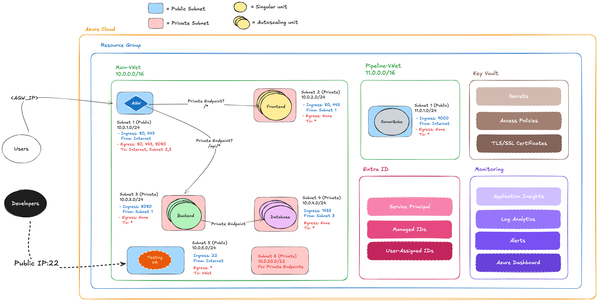
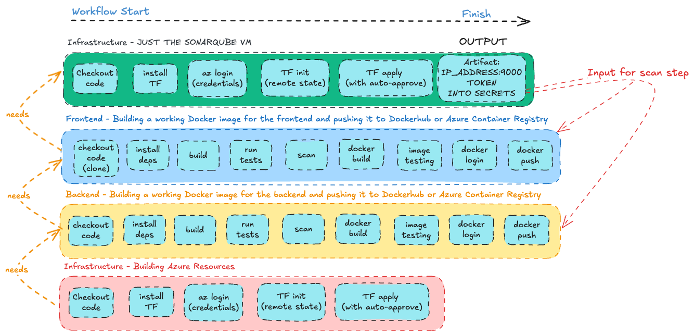
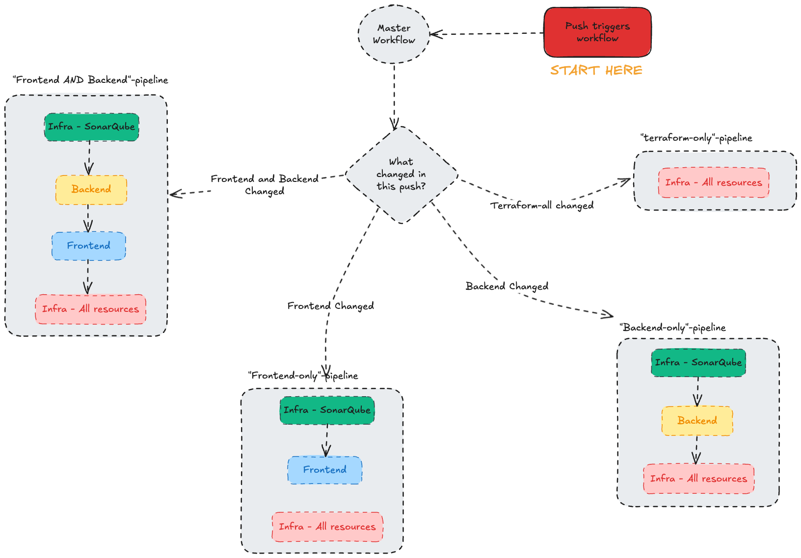

# Project 2 - Three-tier app on Azure with fully automated deployment

Repo structure:

```
.
├── ansible
├── backend
├── frontend
├── terraform-all
└── terraform-sonarqube
```

The main goal is to **fully automate** the deployment of a three-tier web app, from containerization, pushing to a registry (Dockerhub by default), to provisioning the infrastructure required on Azure. This was accomplished using modern tools such as Terraform, Ansible, and Github Actions.

## Team Members

- Ali Aljaffer (Team Lead, Scrum Master) [github/alialjaffer](https://github.com/aliAljaffer)
- Rashid Alharbi (DevOps Engineer) [github/Rashid0029](https://github.com/Rashid0029)
- Maryam Almusajin (DevOps Engineer) [github/maryamalmusajin](https://github.com/maryamalmusajin)
- Abdulilah Alomrani (DevOps Engineer) [github/Aboodx0191](https://github.com/Aboodx0191)
- Bayan Alzahrani (DevOps Engineer) [github/bayanzh](https://github.com/bayanzh)
- Ahmed Aljohani (DevOps Engineer) [github/lord0q](https://github.com/lord0q)

## App Features

1. Images with commit-based tags. Helps to track changes when using commit hashes as image versions.
2. Secure connections using Private Endpoints for the Database layer and App Services. The only public-facing point-of-contact is the application gateway, which takes care of the pathing.
3. Monitoring and Autoscaling ensure the app will react to the workload it's under.
4. Efficient CI/CD pipelines that are orchestrated by a singular master workflow that will trigger the appropriate pipeline based on which directories changed.
5. Scanning of the repository is done via SonarQube hosted on a VM. The SonarQube is deployed separately from the rest of the application.

## System Design - Ali Aljaffer

### System Architecture



A brief overview on the main components of the system. Key Vault is used in the CI/CD pipelines to update and retrieve the SonarQube token, and will soon also use it to store other secrets such as Dockerhub Token.

## CI/CD Pipelines as a Whole



In the diagram we see the distinct 4 pipelines: [Sonarqube](./.github/workflows/sonarqube.yml), [Frontend](./.github/workflows/fe.yml), [Backend](./.github/workflows/be.yml), and [Infrastructure](./.github/workflows/infrastructure.yml). None of these trigger on push or pull request - rather they are all orchestrated by the master workflow seen below.

## The Orchestrator Workflow



Depending on what changed in the push, the [Master Workflow](./.github/workflows/master-workflow.yml) will decide on which set of steps it will run. This keeps the runs efficient, and only changing what needs to be changed for the current iteration of the repository.

## Tech Stack

- Frontend App

  - Reactjs + Vite
  - React Router

- Backend App

  - Java + Maven
  - Springboot

- Database

  - Azure SQL for Production, PostgreSQL for Development

- Infrastructure
  - Azure Cloud
  - Terraform
  - Ansible

## Terraform Infrastructure - Abdulilah Alomrani

### Application Gateway (Secure Entry Point)

- WAF v2 Configuration: Deployed Web Application Firewall with OWASP 3.2 rules in prevention mode

- Path-Based Routing: Intelligent traffic routing with / → frontend and /api/* → backend services

- Health Monitoring: Automated health probes continuously verify service availability

- Public Isolation: Single public entry point that prevents direct access to backend services

- I designed and implemented the secure cloud foundation for our 3-tier application using Terraform, focusing on zero-trust security principles and production-ready configurations.

### Application Gateway (Secure Entry Point)

- Private Endpoint Architecture: Database completely isolated from public internet with private DNS resolution

- Zero Public Access: Configured public_network_access_enabled = false to eliminate exposure

- Network Security Groups: Strict firewall rules allowing only port 1433 from authorized subnets

- Production Configuration: Enterprise-grade SQL setup with proper collation and scaling settings

### Security & Compliance

This infrastructure meets all project security requirements by ensuring no direct public access to compute resources or database, while maintaining full functionality through the Application Gateway secure proxy.

## Screenshots

WIP

## Challenges

1. `(Ali)` Master Workflow: Turning the singular workflows into a working unit, taking inputs and spitting out outputs, sharing secrets between them was a fun but frustrating. By the end, I had triggered around 100 workflow runs - trying to pinpoint exactly what was going wrong.
2. `(Ali)` Ansible Configuration: Initially, I used a [cloud-init](./terraform-sonarqube/azure/vm/cloud-init/sonarqube-install.sh) shell script that did EVERYTHING. But, I wanted to incorporate Ansible into this project, so I reduced the shell script to only downloading and running SonarQube. I let Ansible take care of changing the default Admin password and then token generation. It was challenging because this is my first time working on Ansible outside of the bootcamp's labs.
